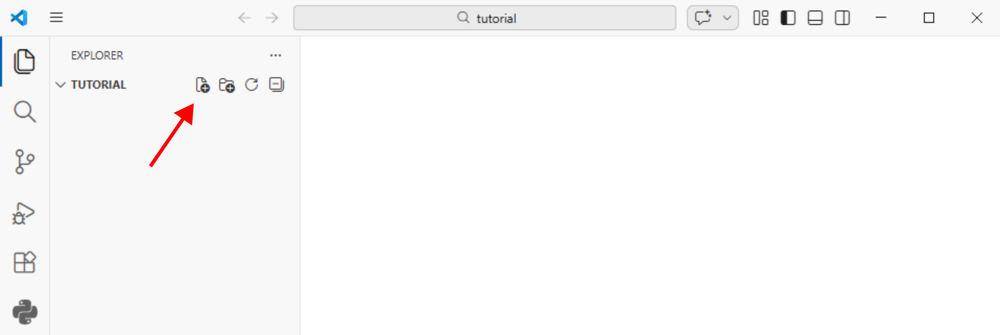

LaTeX Examples
==============

- Make a folder named ``tutorial`` anywhere on your computer
- Open VS Code
- Go to File - Open Folder and select the ``tutorial`` folder you just created
- Create a new file named ``document.tex`` in the folder (see figure below).

Copy and paste the following code into ``document.tex``:

.. code-block:: latex

    \documentclass{article}   

    \title{My Title}
    \author{Your Name}   

    \begin{document}

        \maketitle

    \end{document}

Click the ``Build LaTeX project`` button in the top right corner of VS Code (shown with the red arrow in the figure below). This will compile your LaTeX document and generate a PDF file named ``document.pdf`` in the same folder.

.. image:: _static/vscodeplay1.png
   :alt: Build LaTeX Project Button in VS Code
   :width: 500px
   :align: center

Notice the pdf and other files generated in the folder in the figure below.

.. image:: _static/vscodeplay3.png
   :alt: Generated PDF Files in VS Code
   :width: 500px
   :align: center

Click the ``View LaTeX PDF`` button (shown with the red arrow in the figure below) that appears after building the project to view the generated PDF file.

.. image:: _static/vscodeplay4.png
   :alt: View LaTeX PDF Button in VS Code
   :width: 500px
   :align: center

