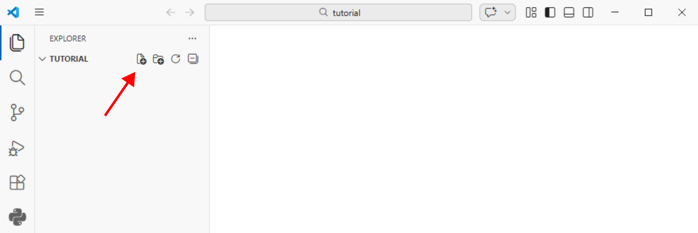
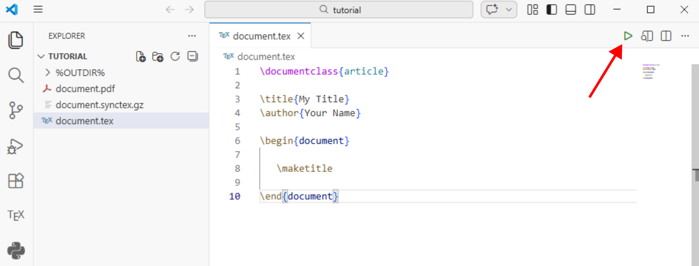
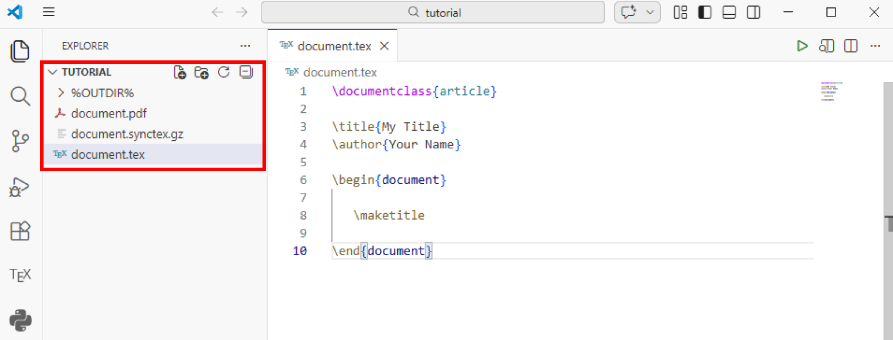
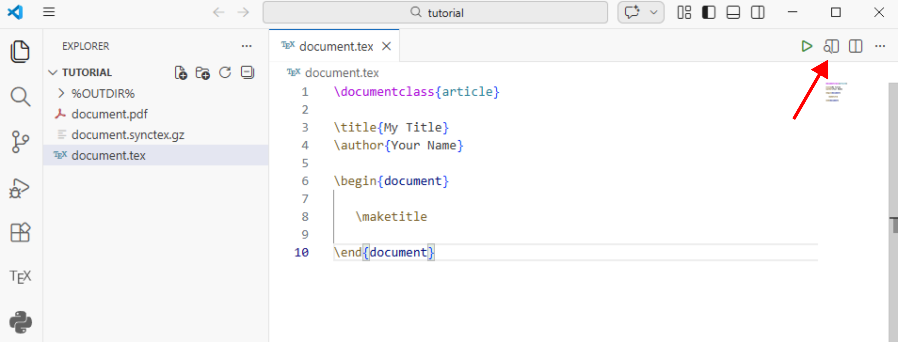

# Minimal LaTeX Document

In this section, we will create a minimal LaTeX document and compile it to generate a PDF file.

- Make a folder named ``tutorial`` anywhere on your computer
- Open VSCode
- Go to File - Open Folder and select the ``tutorial`` folder you just created or drag and drop the folder into VSCode
- Create a new file named ``document.tex`` in the folder by clicking the button shown with red arrow in the figure below



Copy and paste the following code into ``document.tex``:

```
    \documentclass{article}

    \title{My Title}
    \author{Your Name}

    \begin{document}

        \maketitle

    \end{document}
```

There are different document classes in LaTeX, such as ``article``, ``report``, and ``book``. In this example, we are using the ``article`` document class, which is suitable for short documents like lecture notes and assignments. The ``\title`` and ``\author`` commands are used to set the title and author of the document, respectively. The content of the document goes between the ``\begin{document}`` and ``\end{document}`` commands. In this example, we are using the ``\maketitle`` command to generate the title section of the document.

Click the ``Build LaTeX project`` button in the top right corner of VS Code (shown with the red arrow in the figure below). This will compile your LaTeX document and generate a PDF file named ``document.pdf`` in the same folder.



Notice the PDF and other files generated in the folder in the figure below.



Click the ``View LaTeX PDF`` button (shown with the red arrow in the figure below) that appears after building the project to view the generated PDF file.

