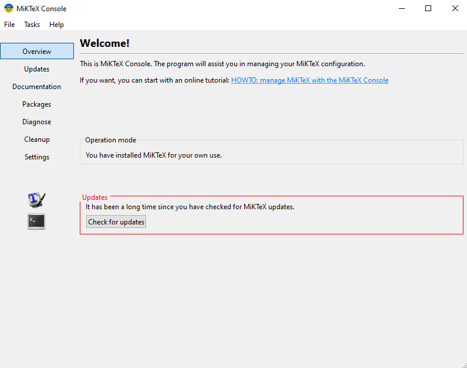
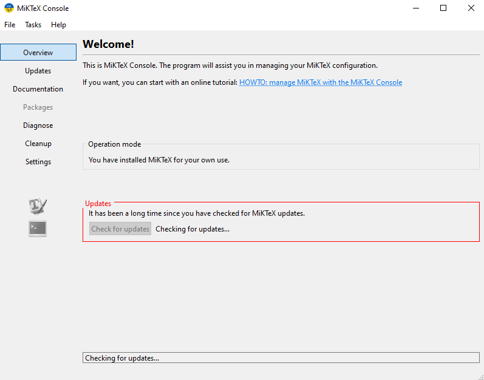
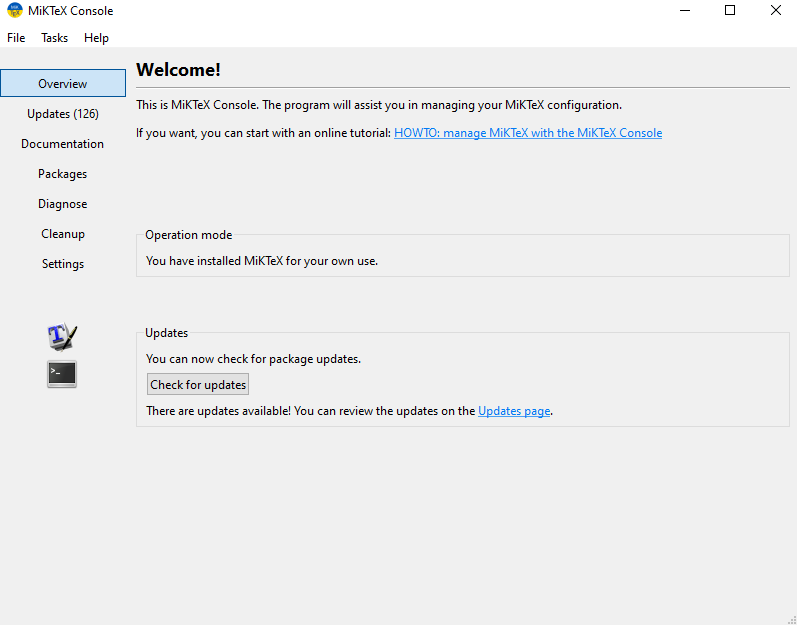
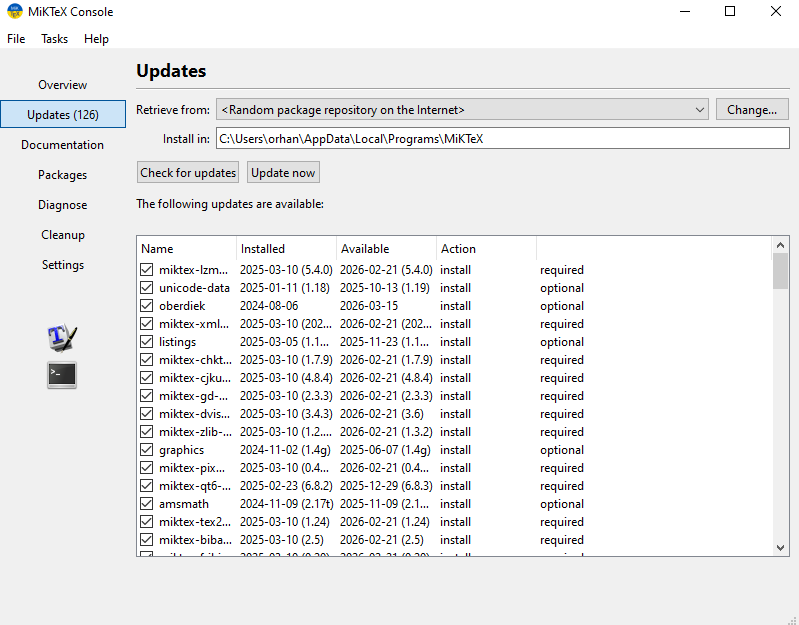

# MikTeX installation

Go to [MikTeX website](https://miktex.org/download) and download the installer for Windows. Run the installer and follow the instructions to install MikTeX on your computer.

# Update MikTeX packages

After installing MikTeX, you need to update the packages. Open the MikTeX Console (you can search for it in the Start menu).

In the MikTeX Console, go to the *Updates* tab, and click *Check for updates*.

If there are any updates available, click *Updates Page* to see the list of updates.

Click *Update now* to install the updates.

# Perl installation

Go to [Strawberry Perl website](https://strawberryperl.com/) and download the installer for Windows. Run the installer and follow the instructions to install Perl on your computer.